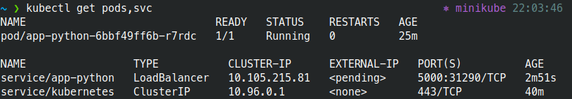
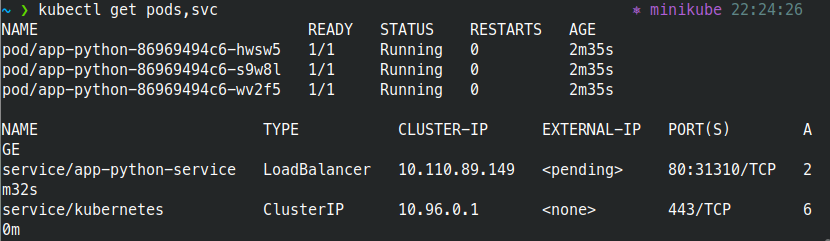
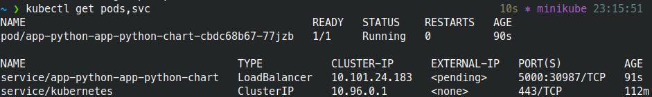

# Kubernetes Deployment

## Creating deployment and services from CLI

Output of the command: 

```bash
~ ❯ kubectl get pods,svc                                              ⎈ minikube 22:03:46
NAME                              READY   STATUS    RESTARTS   AGE
pod/app-python-6bbf49ff6b-r7rdc   1/1     Running   0          25m

NAME                 TYPE           CLUSTER-IP      EXTERNAL-IP   PORT(S)          AGE
service/app-python   LoadBalancer   10.105.215.81   <pending>     5000:31290/TCP   2m51s
service/kubernetes   ClusterIP      10.96.0.1       <none>        443/TCP          40m
```



## Creating deployment and services from configuration files

Output of the command:

```bash
~ ❯ kubectl get pods,svc                                              ⎈ minikube 22:24:26
NAME                              READY   STATUS    RESTARTS   AGE
pod/app-python-86969494c6-hwsw5   1/1     Running   0          2m35s
pod/app-python-86969494c6-s9w8l   1/1     Running   0          2m35s
pod/app-python-86969494c6-wv2f5   1/1     Running   0          2m35s

NAME                         TYPE           CLUSTER-IP      EXTERNAL-IP   PORT(S)        AGE
service/app-python-service   LoadBalancer   10.110.89.149   <pending>     80:31310/TCP   2m32s
service/kubernetes           ClusterIP      10.96.0.1       <none>        443/TCP        60m
```



## Helm

* Chart was installed by `helm install app-python ./app-python-chart` command

Output of the command:

```bash
~ ❯ kubectl get pods,svc                                                        10s ⎈ minikube 23:15:51
NAME                                              READY   STATUS    RESTARTS   AGE
pod/app-python-app-python-chart-cbdc68b67-77jzb   1/1     Running   0          90s

NAME                                  TYPE           CLUSTER-IP      EXTERNAL-IP   PORT(S)          AGE
service/app-python-app-python-chart   LoadBalancer   10.101.24.183   <pending>     5000:30987/TCP   91s
service/kubernetes                    ClusterIP      10.96.0.1       <none>        443/TCP          112m
```


