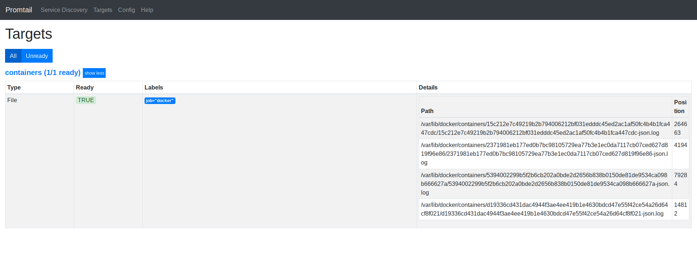
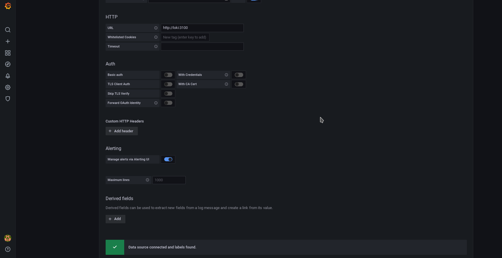
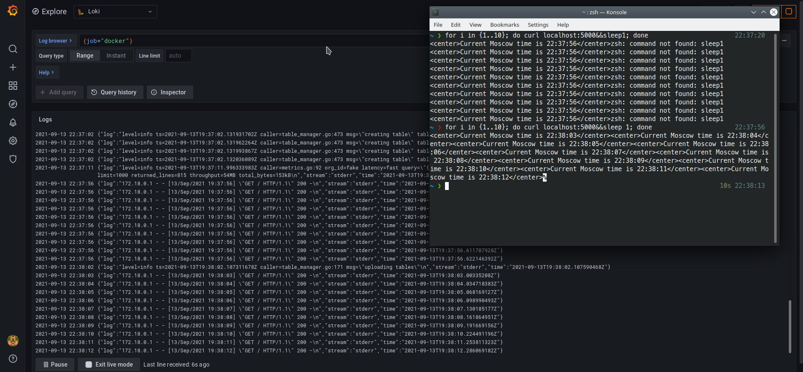

# Monitoring

> All the done configuration was inspired by [the following guide](https://susi.dev/prometheus-grafana-loki-with-docker-compose)
> and also by the provided [example nginx config](https://github.com/black-rosary/loki-nginx)

## Screenshots for Lab 7

### Promtail target files list

### Loki's configuration window in Grafana

### Grafana query interface for Loki

## Best practices for Promtail, Loki and Grafana

1. Utilize the static labels in Loki
2. Avoid usage of dynamic labels in Loki
3. Configure caching in Loki
4. Log time should be increasing per log stream in Loki
5. Utilize the drawing mode in Grafana
6. Use four golden signals to monitor the system in Grafana
7. Use appropriate time for alerting evaluation in Grafana
8. Query for different time ranges for alerts in Grafana

## References

* <https://grafana.com/docs/loki/latest/best-practices/>
* <https://microsoft.github.io/code-with-engineering-playbook/observability/tools/loki/>
* <https://grafana.com/docs/grafana/latest/best-practices/common-observability-strategies/>
* <https://wikitech.wikimedia.org/wiki/Performance/Runbook/Grafana_best_practices>
* <https://sre.google/sre-book/monitoring-distributed-systems>

